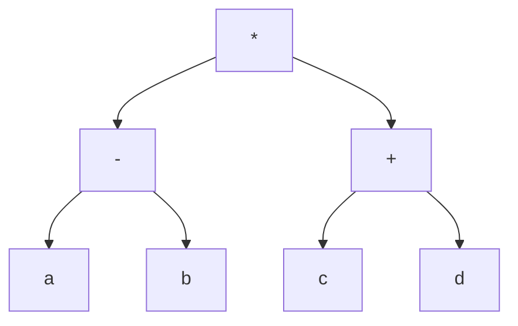

## 编译和解释 

常见的编译流程是 

词法分析 语法分析 语义分析 中间代码生成 代码优化 目标代码生成

## 文法 

>[!key] 程序语言设计的文法是指用来描述编程语言结构和语法规则的系统 

| 类型  | 别称    | 说明  | 对应自动机     |
| --- | ----- | --- | --------- |
| 0   | 短语    |     | 图灵机       |
|     | 上下文有关 |     | 线性界限自动机   |
|     | 上下文无关 |     | 非确定的下推自动机 |
|     | 正规    |     | 有限自动机     |
|     |       |     |           |

### 语法推导树 

### 有限自动机 

>[!key] 给出的文法可以让其从初态转移到终态

>[!tip] 确定的有限自动机 
>这里的确定 表示的是 给定的输入有多少种转移结果, 如果多种可能就是不确定的 

出现的题型 : 
读图给出该自动可以识别的类型. 

### 正规式 

>[!key] 有限自动机的另一种表达形式 

>[!note] 类似于正则表达式 
>a|b 表示 a 或 b
>ab* a 表示 以a开头和a结尾 b出现的次数位n次(可能为0)

### 表达式 

>[!key ] 类似于树的 先序遍历 中序遍历 
前缀表达式 中缀表达式 后缀表达式 

>[!exp]- 表达式 (a-b) * (c+d) 的后缀式(逆波兰式)是  
>可以构建如下的语法树 

前缀式 (先序遍历) 根左右   * - ab + cd
中缀式 (中序遍历) 左根右   a - b * c + d 
后缀式 (后续遍历) 左右根   ab- cd+ *