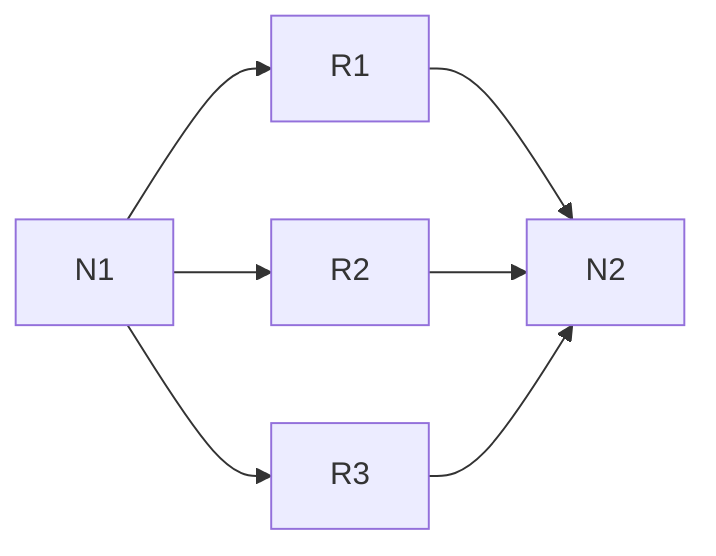
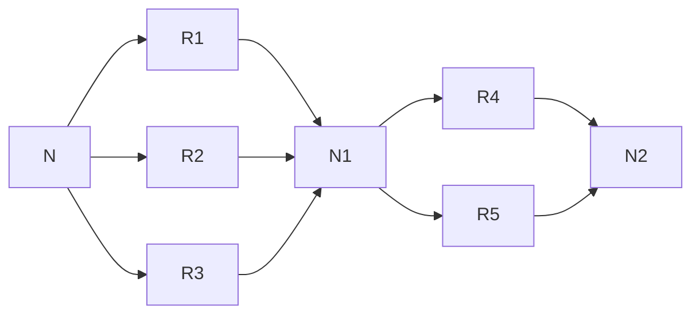

## 串并联电路

>[!key ] 我们并不需要计算电阻,我们只需要确保电路是联通的.

### 可靠度计算 

好简单啊,这其实就是一个初中的物理知识. 

可靠度 R , 通常是指前小时可靠度 , 也就是系统运行一千个小时不出现故障的概率/稳定的概率. 

换言之, 系统出现故障的概率就是 1-R. 

#### 并联电路的可靠度计算 

>[!key ] 请忽略我们的N(node)这里并不表示任何的电路器件,只是为了占位

单一原件的可靠度为R,不可靠度为1-R, 只要有一个在工作就可以保证系统的稳定运行. 虽然计算系统稳定运行的概率不好计算,但是可以通过求其互斥事件-- 系统故障的概率来计算. 

系统故障的概率也就是3个元器件都故障, 每个事件独立,可以计算得到 $系统故障概率 =(1-R)^3$  即并联系统可靠度为 $1-(1-R)^3$ 

我们很快就可以将该公式推导到n的并联的电路上, 其可靠度为  $1-(1-R)^n$ 

#### 串联系统的可靠程度 

只有当串联电路的每一个原件都正常工作,电路才是联通的. 

系统的可靠度为 $R^2$ 

#### 串并联电路 

>[!key] 分而治之 
>从整体区分,从细节计算. 

>[!exp] 请计算下面系统的可靠度. 每个部件的可靠度都为R. 

整体区分 --> 这是一个串联电路. 
细节计算 --> "串联"的原件的可靠度可以通过并联电路快速计算分别得到  $1-(1-R)^3$ 和 $1-(1-R)^2$ . 
合并, 将两个"串联"部件的可靠度相乘得到  $(1-(1-R)^3) (1-(1-R)^2)$  

