````col
```col-md
flexGrow=1
===
> [!note] 定义
> 本意 : 美人鱼 , 其实是一种图表绘制语法,可以在markdown绘制流程图,饼图等. 

> [!cite]- 参考资料
> [Mermaid Live Editor](https://mermaid.live/edit#pako:eNqFUDsKAkEMvcqSek8wtWBlZTtNnISdYZ0PISPIsnc3umqhiKke7xNeskCoxOBgSroXbNGXwSbUnJN-45NgCXEgvvC5tqceOcy16wf7Y8PbnTGVjcosE_9LwwjmsxBZ2eWueNDImT04g4Qye_BlNR92rcdrCeBUOo_QG6HyLuEkmF8kU9Iqh-34xw_WG5WOWVk)
> [Flowcharts Syntax ](https://mermaid.js.org/syntax/flowchart.html)
```
```col-md
flexGrow=1
===


> [!info] 优点
> 基于文本绘制,占据资源空间小


> [!error] 缺点
> 表达性较差,渲染效果未必好看.
```
````
## 实例图

方便你查看渲染的效果,一图胜千言
### Flow

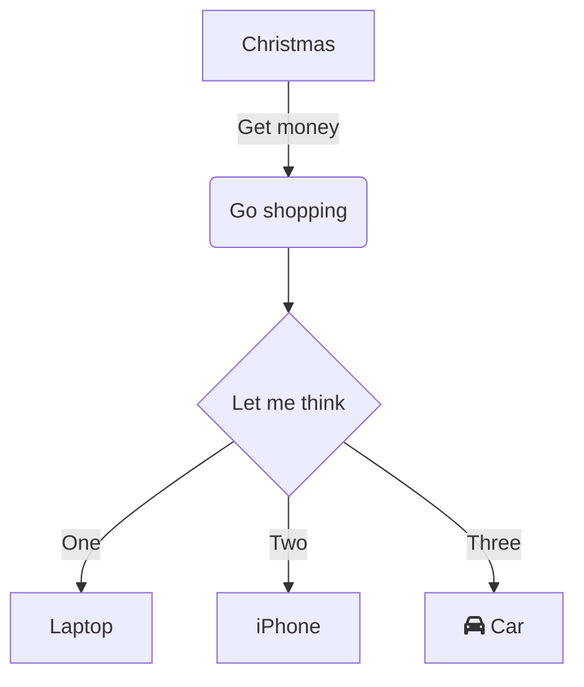

### Class
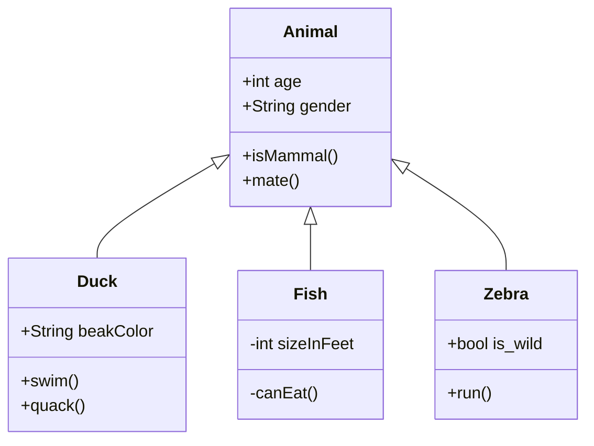

是一种描述的手段但是我确实用得非常少

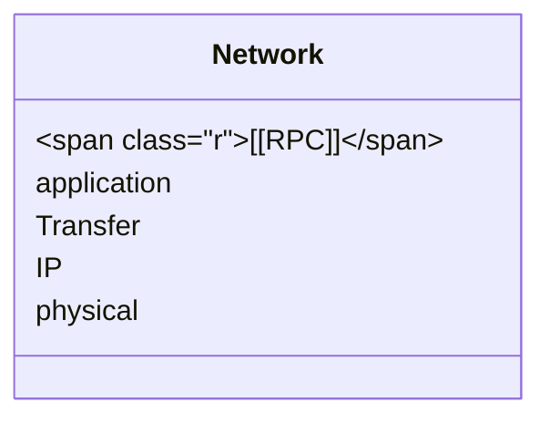

### Sequence

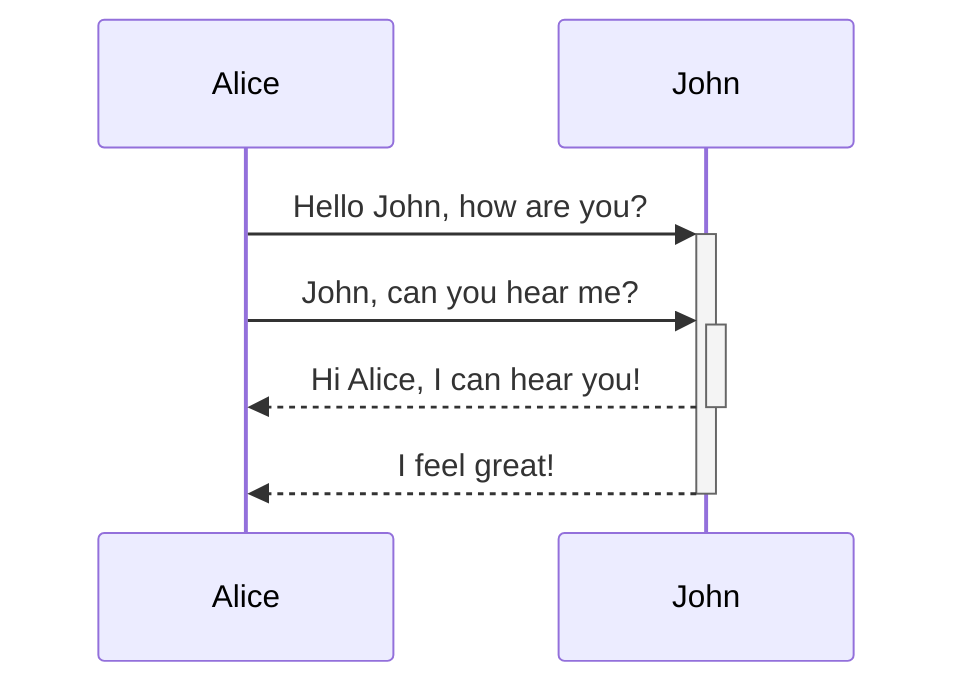


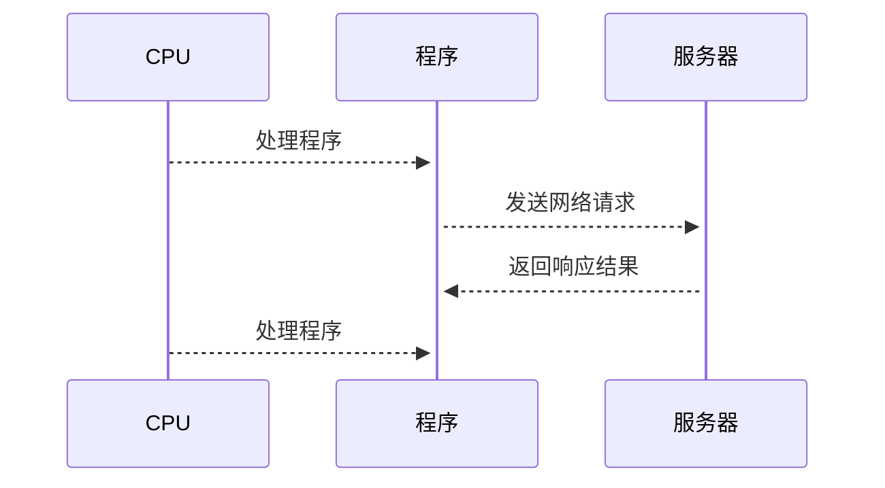

### Git
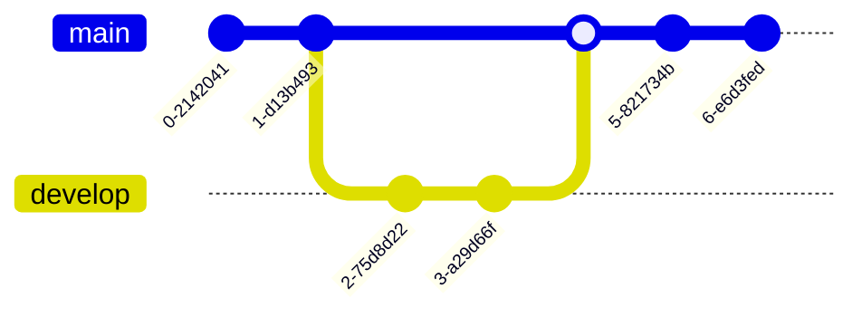
### State
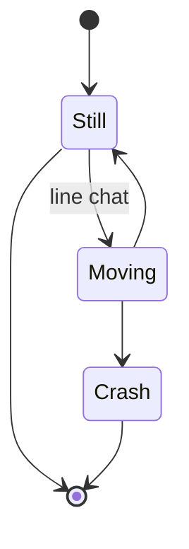


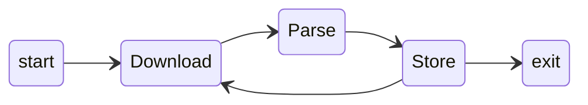


### Pie
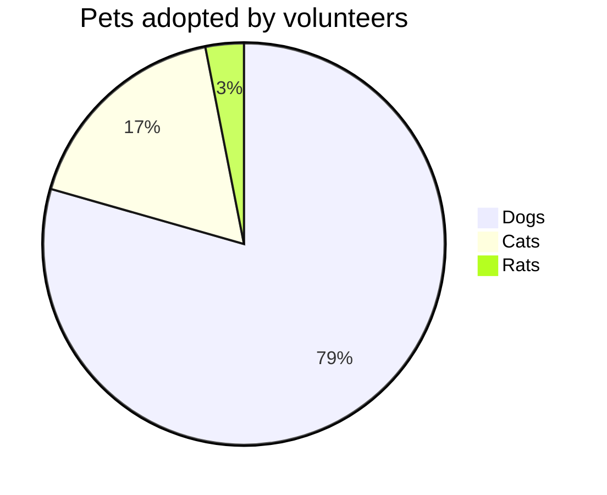


### Gannt

甘特图 还是很有意思的.
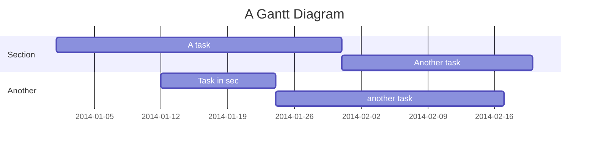


### Er

说实话 我不知道ER图是什么 ? 
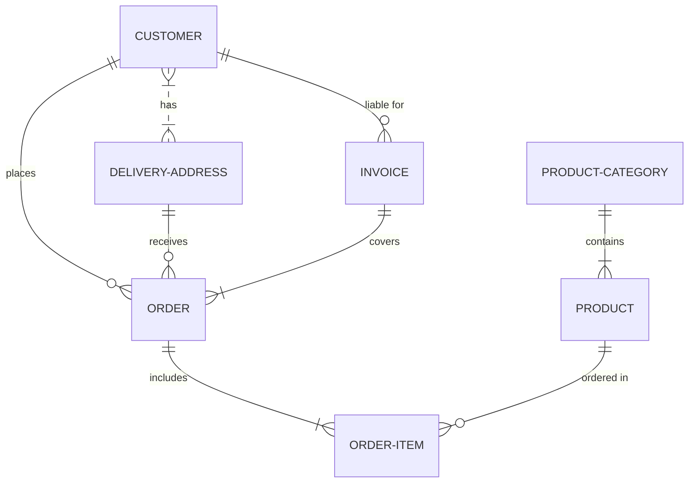


### Mindmap

为什么我们不适用xmind这样的软件呢? 

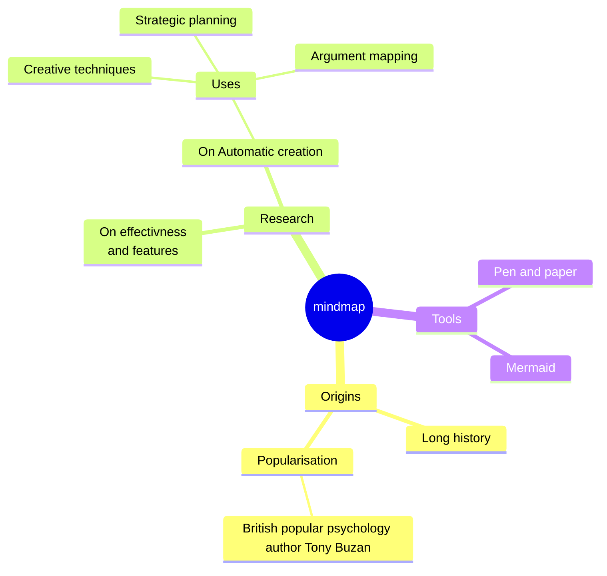


### QudrantChart

最没用的一张图不是吗? 

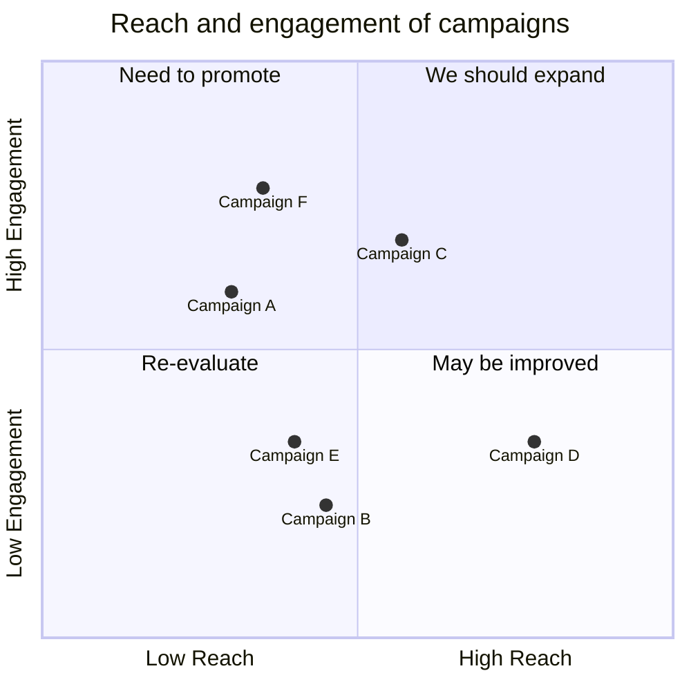


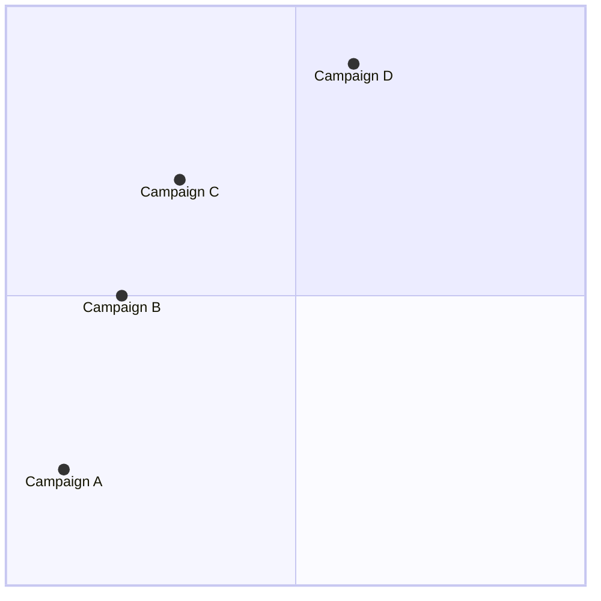
