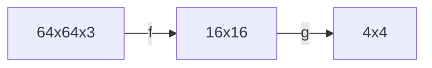

## 神经网络 

>[!faq]- 人的脑容量是有限的吗? 
>其实不需要仔细地思考,你应该也会认为人的脑容量不是无限的. "无限"这个词充满了魔力,不应该出现在真实世界里. 

人一生将会遇到无数种情况,你不可能学会所有情况的处理方式后再步入社会, 一方面是你无法收集无数种情况,另一方面是你的脑容量也是有限的. 

那么我们的大脑该如何做呢?

通过神经网络来进行表达更为复杂的模型. 

下面是一个64x64x3的图像分类模型,通过图像的卷积处理,最后只有16类. 我们实现了将12288种可能分到了16类,这比起记忆12288种可能,需要的"容量"要少得多,并且可以通过修改f和g的权重,可以实现模型的更新. 

### 神经突触 

重新定义学习, 学习就是利用以例子,重塑大脑链接的过程. 

