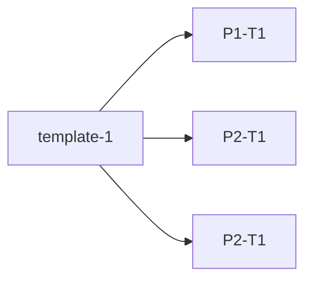
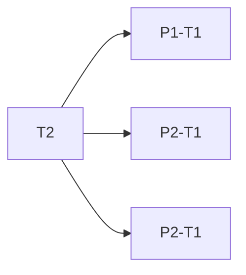

## 一个关于模板库的问题

你编写了一些库函数以供后续复用,可能很多项目都用得上. 所以你专门为这些库函数创建了一个仓库,我们称其为 template .  

你肯定有的时候会修改你的代码. 假如你修改了 template (其版本变成 T2) , 你需要同步所有的其他以该模板创建项目. 这非常复杂,几乎是不太可能实现的,特别是如果你将 Project进行移动,拷贝等操作.  

类似的,如果你修改的是项目中的代码,还是难以将修改结果同步到其他Project和Template中. 

>[!faq] 有没有办法可以建立文件之间的关联呢? 让其可以同步修改 

>[!done] 硬链接 和 符号链接  

### 符号链接  

>[!tip] 简单并且迅速 

>[!warning] 符号链接的路径问题
>比如你建立了如下的符号链接 `ln -s  /xxx/xxx/folders   /aaa/bbb/folders `, 假设你当前的路径为`/aaa/bbb`,当你执行了`cd folders` 你的 `pwd` 就会变成 `/xxx/xxx/folders` 这可能会引发一些问题 
>但是例如进行 `touch cp rm` 之类的操作是没有问题,会自动进行路径的解析. 

>[!error]  移动/重命名/删除 链接的目标项目 
>符号链接可以理解为一个固定 redirect , 例如 `xxx -> /aaa/bbb/folder` . 除非你重新建立链接,否则会因目标变化而导致 `broken symbolic link` . 
>

其实感觉可以解决大部分的问题了,我们就使用这个呗 

## hard link 

>[!done] 避免了上面的 `cd` 后路径错误的问题 
>同时不必担心因为移动文件夹/文件导致出现错误 

>[!warning] 无法为文件夹建立硬链接 
>或者说应该是无法直接将文件夹下的附属文件进行硬链接, 需要自己实现具体具体逻辑. 

## 自己设计一个LinkProject 

主要解决
1. 模板库要求可同步
2. 可以进行一些简单的初始化工作 

