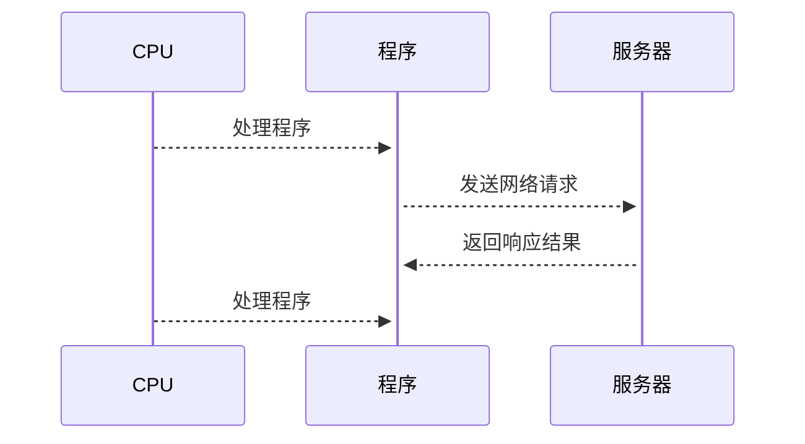
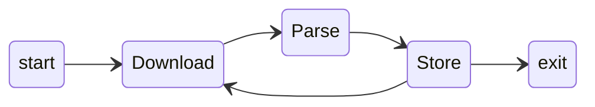

## 用户友好的爬虫框架

![[Pasted image 20231111210000.webp]]


--- 
 
## 项目特色

* 基于 [gevent](https://www.gevent.org/) 的协程并发,避免IO阻塞
* pipeline的流水线处理,减少内存开销
* 基于 [rich](https://github.com/Textualize/rich) 渲染进度条,便于监控进度
* 异常恢复
* 预设持久化方

---

>[!abstract] 爬虫性能瓶颈分析
> 爬虫作为非常经典的IO密集型应用,性能瓶颈在获取网络请求和将数据持久化的过程,是我们优化的重心. 

![[Pasted image 20231110201830.webp]]

--- 

由于GIL的存在,python单一时间里只能存在一个线程获取解释器.使用gevent可以避免IO阻塞,利用CPU等待的时间,从而提高程序性能. 


---- 

>[!abstract] 流水线处理 
> 
> 利用 yield 构造的生成器实现流水线处理,减少中间对象的产生. 

![[Pasted image 20231110204410.webp]]



--- 

> [!note] 实现细节
> 
> 除了处理请求和传输对象外,还需要更新进度条的进度和状态管理器. 

![[Pasted image 20231110204623.webp]]

---

  
## 效果演示 

>[!example] 以爬取雪球网10只股票信息为例子. 
>* 进度条提示 
>* 异常恢复


--- 

## 进度条提示

![[Pasted image 20231110203856.webp]]

--- 

## 异常恢复

![[Pasted image 20231110204245.webp]]


--- 

>[!done] 可选持久化方式 
> 1.本地文件
> 2.excel
> 3.sqlite数据库

---

## 自定义持久化方式 

基层Database并实现write和close方法,分别用于存储parse返回的对象和关闭文件. 

```python
class DataBase:
    def __init__(self) -> None:
        pass
    def write(self,data):
        pass
    def close(self):
        pass
```
