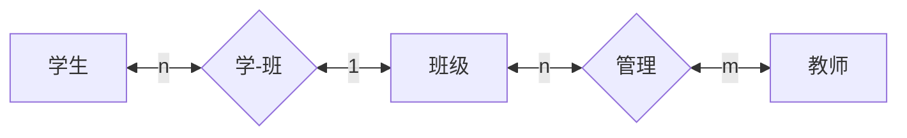

[[history sql]]
[[DATA/DATABASE/SELECT|SELECT]]
[[agg]]
## 准备开始

> [!note] 我们将会建立一个最常见的学生信息管理系统. 可能会不断扩充和升级 
> 一共有三张表,或者说三个关系
> 学生信息表 班级表 教师信息表

>[!note] 依赖关系
>一个班级有多个学生,一个班级有有多个任课教师,一个老师可能管理多个班级. 


>[!example]-   初始化数据库
>```sql
>
>```


>[!example] 查看学生信息
> ```sql
> select * from student limit 1;
> ```

>[!example] 查看班级信息
>```sql
>select * from  class limit 1;
>```

>[!example]  查看教师信息
>```sql
>select * from teacher limit 1;
>```

>[!faq]- 多对多的数据冗余
>这里表示多对多的关系中,班级表会出现冗余,因为一个班有多个老师,需要多条数据来存储. 你有解决方法吗? 


添加一个中间表,用于存储班级和老师的信息. 

ID(P) ,teacher_id , class_id ; 
当文明想要查看1班的教师有哪些,只需要对着这个表进行select * from就好了. 

我们应该仔细区分其中的细节,不然是无法体会到建立表格的

之前都是在凭借着直觉,但是那确实是依靠"天分"的,现在我们有了完备了逻辑理论,让我们可以比较轻松地建立高效且正确的数据库系统. 

## select 

>[!note] 获取数据
>范式
>select col1,col2 ... from table1,table2 where condition addition operate.

>[!example] 只获取学生的学号和姓名信息
>通过修改`[cols]` 实现查询不同的结果,对应投影操作. 
>```sql
>select id,name from student limit 1;
>```

关键字汇总 distinc 
join不记得了,应该不会要求把 
delete table where 

| 查询类型 | 例子 | SQL |
| ---- | ---- | ---- |
| 条件查询 | 查询年纪大于40岁的老师 | select * from teacher where age > 50; |
| 模糊查询 | 查询姓李的学生 | select * from student where name like "李%" |
| 范围查询 | 查询年级在40岁到50岁之间的老师 | select * from teacher where age between 40 and 50; |
| 有序 | 将老师按照年龄排序 | select * from teacher order by age ;  |
| 连接查询 | 查询学生编号为201215121的教师信息 |  |
| 嵌套查询 |  |  |
| 有限 |  |  |
| 无重复 |  |  |


### 等值连接 


