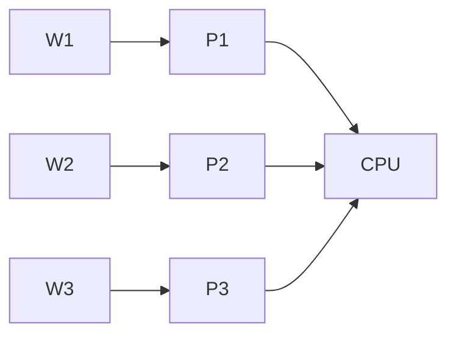

## 例子 

学了C语言的人,肯定认为代码是一行一行执行,从第11行到12行,最多再加上一个`goto` 从第8行开始执行. 流程固定了. 要想实现,3分钟后执行一个任务,可以创建一个线程,让其等待三分钟,然后执行. 

现在我们来看看异步. 

其实上面的例子中就已经有异步的影子了,不是吗? 

实现异步肯定有并发,但是不一定有并行,这里就让我有一点难受了,因为我就是想利用这个来实现内容啊.

C语言没有在语言层面提供异步.

单核其实可以模拟多核心的.  CPU只需要在不同的线程中切换,从宏观上看,就是和多处理器是一致的,没有并且但是有并发. 并且对于用户态基本上没有什么感知. 

所以其实单核也是可以实现异步的,不过确实是需要并发. 

## 多线程

#### 线程

线程是进程的执行单元，怎么说，进程运行在计算机上，其中有很多个任务，这些任务就是由执行单元 --线程来执行的。

多线程就是有多个线程来执行任务，执行的效率毫无疑问会提高，但是它们是共享进程中的资源的，像文件，内存.....

尽然共享文件，那么，两个线程如果 在某一个时间段内同时操作（写）了一份文件，那么这份文件的内容就会出现问题。

那么就出现了一个叫 锁 的东西，它可以避免多个线程在同一个时间修改文件，避免造成问题。

但是 使用锁的过程中也会出现问题，就比如死锁，每个进程都在等待访问共享资源，相互等待共享资源的释放，导致所有的进程或者线程都无法继续执行。

python 中 由于拥有 GIL （全局解释器锁）的存在，所以，同一时刻只能有一个线程执行python代码。 

但这不意为这python没有多线程
