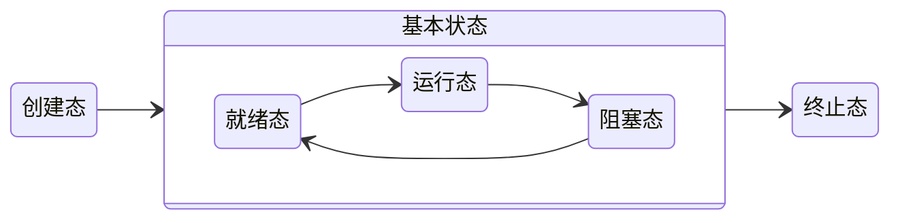
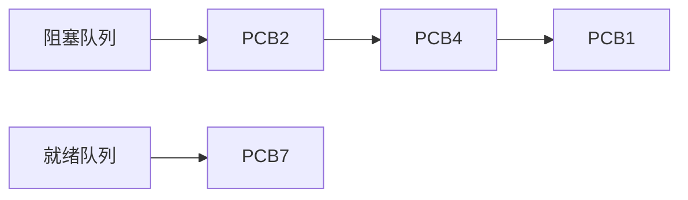

## 进程定义

>[!note] 被加载到了的内存的程序. 

进程是程序的一个实例.所以我们可以利用一个程序加载多个进程.

>[!info] 利用一个qq程序可以开启多个qq客户端,登录多个不同的账号.

### 进程的结构

讨论进程就必须和操作系统一起讲. 用抽象的话讲就是 PCB + 代码段 + 数据段  

PCB就是进程的各种信息,比如PID,使用的CPU时间.   代码段: 程序的执行指令 数据段: 程序定义的各种数据,各种变量.

## 进程的特征

1. 动态性  进程的状态是在不停变化的.
2. 并发性  进程可以并发地执行
3. 独立性  进程之间不会相互干扰
4. 异步性  以不可预测的速度向前执行
5. 结构性 将PCB和程序代码段等数据结构化地组合起来. 

## 进程的状态

一个线程被创建后,基本上就是在就绪态和运行态,阻塞态之间切换,所以这三个状态又被称为基本状态. 




运行态变成阻塞态是进程组主动选择的,比如等待磁盘IO将数据读取,避免长时间占用CPU时间片,就主动让出CPU,等待读取操作完成. 

阻塞态变成就绪态是操作系统执行的,进程根本就无法"感知"阻塞任务是否完成,只能等待操作系统将其的状态修改为就绪态,然后才有获取CPU时间片然后执行的资格.

### 进程的组织方式

>[!error] 太学术了,感觉根本用不到. 

链接方式 和 索引方式. 

* 利用链表将PCB连接起来.


* 建立一张表.

````col
```col-md
flexGrow=1
===
| 阻塞表 |
| ------ |
| PCB2   |
| PCB4   |
| PCB1   |
```
```col-md
flexGrow=1
===
| 就绪表 |
| ------ |
| PCB7  |
```
````
### 进程控制 

>[!note] 操作系统对于进程状态的转换.

以将阻塞队列中的PCB2移动到就绪队列为例. 

利用原子指令,需要从阻塞队列中删除PCB2,然后将PCB2添加到就绪队列. 如果不是原子指令,中途收到了中断信号,就可能会出现PCB2即在阻塞队列,又在就绪队列的情况.

#### 原子指令的实现

内核指令.

其实就是无视中断, 体现为两个命令, "关中断指令" 和 "开中断指令" .

思考: 普通程序可以

### 进程间通信 

我们进程间通需要借助操作系统实现. 为什么?  

出于安全考虑,A进程不应该可以读写B进程的内容,这样是非常危险的.


方式 : 共享存储 消息传递 管道 
TODO
下面这些就是常说的  IPC
#### 共享存储 

shm_open 

mmap 

缺点 : 因为实现了多进程共享资源,所以必须考虑并发相关的问题. 


#### 消息传递

操作系统提供的syscall是吧

#### 管道

没看出来区别 

## 线程

解决的问题  一个进程需要同一时间执行多个任务,比如游戏需要播放音乐的同时监听用户输入然后渲染画面. 

有了线程后,线程就变成了操作系统调度的最小单位了.

其实可以将线程理解为轻量级进程,其大部分状态和属性和进程是一致的.

### 线程的属性

我们说线程比进程更加轻量的前提是拿进程切换和线程切换做比较.如果是不同进程的线程进行了切换,开销还是非常大的.


### 用户级线程 和 内核级线程 

我们可以实现线程库?


### 线程的状态和进程的状态完全一致.


### 调度

高级调度 作业调度 将磁盘中的数据加载到内存

中极调度 将内存中的数据写入磁盘

低级调度 CPU调度,决定哪一个线程可以被CPU分配时间片.


这里的级,并不是真的高级或者复杂的意思,在我看来更多的是发生频率.


    
