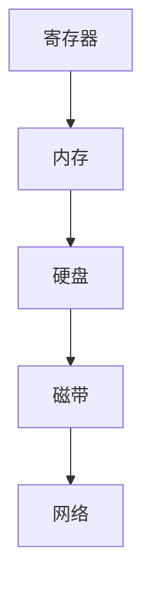

## 什么是内存

临时存储的
指令 =  操作码 + 地址码 + 数据
### 存储层级

## 装载方式

### 绝对装入

在程序被加载之前就提前知道程序的存储位置. 这里就几乎是不可能的,除非是单片机才有可能是这样的. 

早期没有操作系统的情况,没有震？
### 静态重定位  可重定位装入 

当程序被加载到内存时,针对全部的地址参数重新设置修改.

因为在加载时就将全部的地址确定了,所以无法动态开辟内存空间.

### 动态重定位 动态运行时装入 

硬件要求 : 重定位寄存器 

每次读取操作都可以结合重定位寄存器,实现越级加载. 

开始有一点点概念了.

### 链接

#### 静态链接

将其和程序合并为一个相同的内容. 
#### 装入时动态链接

#### 运行时动态链接 

### 覆盖和交换

覆盖技术 

早期计算机内存非常紧缺. 

所以必须需要

交换技术 

利用内存和磁盘相互交换,SWAP分区 

SWAP分区追求换入换出速度，所以采用连续分配方式
但是文件区追求存储空间的利用率，所以采用离散的分配方式。
总之，SWAP的  I/O 速度更快

### 连续内存分配 

单一连续分配 

固定分区分配

动态分区分配：区别于以上两种分配方式，它是根据进程的大小动态地建立分区的，并且让分配的和需要的正好相等。所以系统分区的数目和大小都是可变的。

空闲分区表,

空闲分区链,

动态分区分配算法.

分配给某个进程的内存区域中，有些部分没有用上
内存中某些空闲分区由于太小而难以利用

